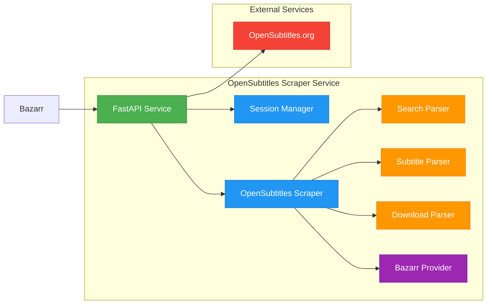

# 🎬 OpenSubtitles Web Scraper Service

[](https://www.python.org/downloads/)
[](https://fastapi.tiangolo.com/)
[](LICENSE)

A standalone Python service that scrapes OpenSubtitles.org using cloudscraper, providing API-compatible endpoints that can be used as a drop-in replacement for OpenSubtitles API providers in Bazarr.

## 🌟 Features

- **🛡️ Cloudflare Bypass**: Uses cloudscraper to automatically bypass Cloudflare protection
- **🌐 Comprehensive Language Support**: Supports all major languages with proper language code mapping
- **⚡ FastAPI Web Service**: RESTful API endpoints with automatic documentation
- **📦 Bazarr Compatible**: Provider interface compatible with existing Bazarr subtitle providers
- **🔍 Robust Parsing**: Advanced HTML parsing for search results, subtitle listings, and downloads
- **🔧 Error Handling**: Comprehensive error handling and logging
- **🐳 Docker Support**: Containerized deployment for easy setup and scaling


## 🏗️ Architecture




## 🚀 Quick Start

### Docker Deployment (Recommended)

The easiest and most reliable way to run this service is using Docker:

1. **Build and run with Docker Compose**:
   ```bash
   docker-compose up
   ```

   The service will start on `http://localhost:8000`

### Manual Installation

If you prefer to run the service directly on your system:

1. **Clone/Create the project directory**:
   ```bash
   cd /path/to/your/projects
   # The opensubtitles-scraper directory should already exist
   ```

2. **Install dependencies**:
   ```bash
   cd opensubtitles-scraper
   pip install -r requirements.txt
   ```

3. **Run the service**:
   ```bash
   python main.py
   ```

   The service will start on `http://localhost:8000`

## 📡 API Endpoints

### Health Check
- `GET /api/v1/health` - Service health status

### Search
- `POST /api/v1/search/movies` - Search for movies
- `POST /api/v1/search/tv` - Search for TV shows

### Subtitles
- `POST /api/v1/subtitles` - Get subtitle listings for a movie/show
- `POST /api/v1/download` - Download a subtitle file

### Documentation
- `GET /docs` - Interactive API documentation (Swagger UI)
- `GET /redoc` - Alternative API documentation (ReDoc)

## 💡 Usage Examples

### Search for a Movie
```bash
curl -X POST "http://localhost:8000/api/v1/search/movies" \
     -H "Content-Type: application/json" \
     -d '{"query": "Avatar", "year": 2009}'
```

### Get Subtitles
```bash
curl -X POST "http://localhost:8000/api/v1/subtitles" \
     -H "Content-Type: application/json" \
     -d '{"movie_url": "https://www.opensubtitles.org/en/movies/idmovies-123456", "languages": ["en", "es"]}'
```

### Download Subtitle
```bash
curl -X POST "http://localhost:8000/api/v1/download" \
     -H "Content-Type: application/json" \
     -d '{"subtitle_id": "123456", "download_url": "https://www.opensubtitles.org/download/..."}'
```


## 🔧 Integration with Bazarr

To use this service as a provider in Bazarr, you can:

1. **Direct Integration**: Use the provider classes in `src/providers/` directly
2. **API Integration**: Configure Bazarr to use the FastAPI service endpoints
3. **Drop-in Replacement**: Replace existing OpenSubtitles provider with the scraper provider

### Example Provider Usage
```python
from src.providers.opensubtitles_scraper_provider import OpenSubtitlesScraperProvider
from src.providers.base_provider import Language, Movie

# Initialize provider
provider = OpenSubtitlesScraperProvider()
provider.initialize()

# Create video object
video = Movie("Avatar.2009.1080p.BluRay.x264-GROUP", "Avatar", 2009)

# Search for subtitles
languages = {Language('en'), Language('es')}
subtitles = provider.list_subtitles(video, languages)

# Download subtitle
if subtitles:
    provider.download_subtitle(subtitles[0])
    print(subtitles[0].content.decode('utf-8'))

provider.terminate()
```


## 📁 Project Structure

```
opensubtitles-scraper/
├── src/
│   ├── api/                    # FastAPI web service
│   │   ├── models.py          # Pydantic models
│   │   └── routes.py          # API endpoints
│   ├── core/                  # Core scraping engine
│   │   ├── scraper.py         # Main scraper class
│   │   └── session_manager.py # CloudScraper session management
│   ├── parsers/               # HTML parsing modules
│   │   ├── search_parser.py   # Search results parsing
│   │   ├── subtitle_parser.py # Subtitle listings parsing
│   │   └── download_parser.py # Download handling
│   ├── providers/             # Bazarr-compatible providers
│   │   ├── base_provider.py   # Base provider interface
│   │   └── opensubtitles_scraper_provider.py # Main provider
│   └── utils/                 # Utility modules
│       ├── exceptions.py      # Custom exceptions
│       └── helpers.py         # Helper functions
├── vendor/                    # Vendored dependencies (including cloudscraper)
├── main.py                    # FastAPI application entry point
├── requirements.txt           # Python dependencies
├── Dockerfile                 # Docker image definition
├── docker-compose.yml         # Docker Compose service definition
└── README.md                  # This file
```


## 🔑 Key Components

### CloudScraper Integration
- Automatic Cloudflare bypass using the [VeNoMouS/cloudscraper](https://github.com/VeNoMouS/cloudscraper) library
- Session management with proper headers and user agent rotation
- Intelligent retry logic with exponential backoff
- Uses vendored copy in `vendor/cloudscraper/` directory for enhanced features and compatibility

### HTML Parsing
- Robust BeautifulSoup-based parsing for search results
- Comprehensive subtitle metadata extraction
- Support for various OpenSubtitles page layouts

### Language Support
- Comprehensive language code mapping (ISO 639-1, 639-2, and common names)
- Support for hearing impaired and forced subtitle flags
- Automatic language detection from filenames

### Error Handling
- Custom exception hierarchy for different error types
- Comprehensive logging throughout the application
- Graceful degradation when services are unavailable


## 📝 Logging

The service uses Python's built-in logging module. Logs include:
- Request/response information
- Scraping progress and results
- Error details and stack traces
- Performance metrics


## 🔒 Security Considerations

- Input validation and sanitization
- Safe file handling for downloads
- Proper error message sanitization
- Session management security


## ⚠️ Limitations

- Depends on OpenSubtitles.org website structure (may break if they change their layout)
- No built-in rate limiting (implement externally if needed)
- Requires active internet connection
- Subject to OpenSubtitles.org availability and anti-bot measures


## 🛠️ Troubleshooting

### Common Issues

1. **Cloudflare Protection**: If scraping fails, the cloudscraper library will automatically handle most Cloudflare challenges
2. **Parsing Errors**: Website structure changes may require parser updates
3. **Network Issues**: Check internet connectivity and OpenSubtitles.org availability

### Debug Mode

Enable debug logging by setting the log level:
```python
import logging
logging.getLogger().setLevel(logging.DEBUG)
```


## 🐳 Docker Support

This service includes Docker support for easy deployment and scaling:

- **Dockerfile**: Defines the container image with all dependencies
- **docker-compose.yml**: Service definition for easy deployment

### Benefits of Docker Deployment

- Consistent environment across different systems
- Simplified dependency management
- Easy scaling and deployment
- Isolation from host system
- Version control of deployment configurations


## 🤝 Contributing

1. Follow the existing code structure and patterns
2. Keep files under 500 lines as specified
3. Add comprehensive error handling
4. Include logging for debugging
5. Test with real OpenSubtitles.org data


## 📄 License

This project is created for educational and personal use. Please respect OpenSubtitles.org's terms of service and robots.txt when using this scraper.


## 🙏 Acknowledgements

- [FastAPI](https://fastapi.tiangolo.com/) - Modern, fast (high-performance) web framework
- [Cloudscraper](https://github.com/VeNoMouS/cloudscraper) - Python module to bypass Cloudflare's anti-bot page
- [BeautifulSoup](https://www.crummy.com/software/BeautifulSoup/) - Python library for pulling data out of HTML and XML files