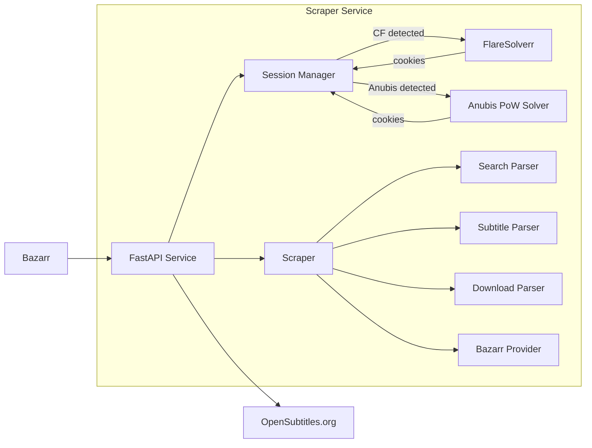

# OpenSubtitles.org Scraper

[](https://www.python.org/downloads/)
[](https://fastapi.tiangolo.com/)
[](LICENSE)

A self-hosted service that scrapes OpenSubtitles.org and exposes Bazarr-compatible API endpoints. Drop-in replacement for the removed .org provider.


## Why this exists

OpenSubtitles.org has been the go-to subtitle database for almost 20 years. Millions of subtitles, contributed by volunteers, freely accessible. That's changing.

The operator is phasing out .org in favour of .com. The problem is that **.com is not ready**. Their own developers have acknowledged missing subtitles, miscategorised episodes, broken sync, and unreliable search. For many languages and older titles, .org is still the only source with real coverage.

Meanwhile, every official way to access .org has been killed. Bazarr dropped its .org provider. The XML-RPC API was shut down. No migration path, no transition tooling. Users who depend on .org content that doesn't exist on .com yet were simply cut off.

This project fills that gap. It gives you back access to .org until .com actually catches up. It ships with strict rate limits out of the box (1 req/s, 60 req/min) because the goal is access, not abuse.

If .org gets shut down before .com reaches parity, that's the operator's call — but it means cutting a community off from the archive it built, not protecting it.

> Rate limits are enforced by default and fully configurable. See [Configuration](#configuration).


## Features

- Cloudflare handling via [cloudscraper](https://github.com/VeNoMouS/cloudscraper) + [FlareSolverr](https://github.com/FlareSolverr/FlareSolverr) fallback
- Native [Anubis](https://github.com/TecharoHQ/anubis) proof-of-work solver in pure Python (no extra dependencies, ~50–500 ms solve time)
- Automatic FlareSolverr integration when Cloudflare "Under Attack" mode is active
- Cookie caching — FlareSolverr/Anubis are only invoked once per challenge cycle, subsequent requests go direct
- Full language support with ISO 639-1/639-2 mapping
- FastAPI service with auto-generated docs at `/docs`
- Bazarr-compatible search and download endpoints
- HTML parsing for search results, subtitle listings, and downloads
- Built-in rate limiting, retry with backoff, and request queuing
- Thread-safe with double-solve prevention and rate limiter locking
- Pre-built Docker image at `ghcr.io/lavx/opensubtitles-scraper:latest`


## Architecture


```mermaid
graph LR
    A[Bazarr] --> B[FastAPI Service]
    B --> C[OpenSubtitles.org]
    subgraph "Scraper Service"
        B --> D[Session Manager]
        B --> E[Scraper]
        D -->|"CF detected"| J[FlareSolverr]
        D -->|"Anubis detected"| K[Anubis PoW Solver]
        J -->|"cookies"| D
        K -->|"cookies"| D
        E --> F[Search Parser]
        E --> G[Subtitle Parser]
        E --> H[Download Parser]
        E --> I[Bazarr Provider]
    end
```

### Challenge Resolution Flow

1. Pre-flight HEAD request detects Cloudflare or Anubis
2. **Cloudflare**: FlareSolverr solves the challenge via headless browser
3. **Anubis**: native Python solver brute-forces the SHA-256 PoW nonce (no browser needed)
4. Cookies + User-Agent are extracted and injected into the session
5. All subsequent requests use the cookies directly until they expire

FlareSolverr is optional — if not configured, the scraper falls back to cloudscraper alone. The Anubis solver is built in and always available.


## Quick Start

### Just the scraper stack (recommended)

Drop this into a `docker-compose.yml` and run `docker compose up -d`. No clone required, pulls the published image:

```yaml
services:
  flaresolverr:
    image: ghcr.io/flaresolverr/flaresolverr:latest
    restart: unless-stopped
    environment:
      - LOG_LEVEL=info
    healthcheck:
      test: ["CMD", "curl", "-f", "http://localhost:8191/health"]
      interval: 30s
      timeout: 10s
      start_period: 60s
      retries: 5

  opensubtitles-scraper:
    image: ghcr.io/lavx/opensubtitles-scraper:latest
    ports:
      - "8000:8000"
    restart: unless-stopped
    depends_on:
      flaresolverr:
        condition: service_healthy
    environment:
      - FLARESOLVERR_URL=http://flaresolverr:8191/v1
    healthcheck:
      test: ["CMD", "curl", "-f", "http://localhost:8000/health"]
      interval: 30s
      timeout: 10s
      start_period: 30s
      retries: 5
```

Service starts on `http://localhost:8000`. FlareSolverr comes up as a sidecar and the scraper waits for it to be healthy. Health check: `curl http://localhost:8000/health` returns `{"status": "healthy", ...}`.

To tune rate limits, retries, or pool sizes, drop a `.env` file next to the compose file (see [Configuration](#configuration)) and add `env_file: [.env]` to the scraper service.

To disable FlareSolverr, remove its block and unset `FLARESOLVERR_URL`. The Anubis solver is built in and still works.

### Full Bazarr+ stack (Bazarr + scraper + FlareSolverr + AI translator)

If you want the whole thing wired up, including a Bazarr fork that already knows how to talk to this scraper, the [Bazarr+ installer](https://lavx.github.io/bazarr/) does it in one shot:

```bash
curl -fsSL https://lavx.github.io/bazarr/install.sh | bash
```

The script ([source](https://github.com/LavX/bazarr/blob/gh-pages/install.sh)) generates a `docker-compose.yml`, a sane `.env`, and a starter `config/config.yaml`.

### From source / development

```bash
git clone https://github.com/LavX/opensubtitles-scraper.git
cd opensubtitles-scraper
pip install vendor/cloudscraper-3.0.0.zip   # vendored fork, see notes
pip install -r requirements.txt
cp .env.example .env   # optional
python main.py
```

The repo's [docker-compose.yml](docker-compose.yml) builds from the local Dockerfile and is intended for development.


## API

| Method | Endpoint | Description |
|--------|----------|-------------|
| `GET` | `/health` | Quick health check (also at `/api/v1/health`) |
| `POST` | `/api/v1/search/movies` | Search movies |
| `POST` | `/api/v1/search/tv` | Search TV shows |
| `POST` | `/api/v1/subtitles` | List subtitles for a title |
| `POST` | `/api/v1/download/subtitle` | Download a subtitle file |
| `POST` | `/search`, `/api/v1/search` | Bazarr-compatible search shim |
| `POST` | `/download`, `/api/v1/download` | Bazarr-compatible download shim |
| `GET` | `/docs` | Swagger UI |

### Examples

```bash
# Health
curl http://localhost:8000/health

# Search
curl -X POST http://localhost:8000/api/v1/search/movies \
     -H "Content-Type: application/json" \
     -d '{"query": "Avatar", "year": 2009}'

# List subtitles
curl -X POST http://localhost:8000/api/v1/subtitles \
     -H "Content-Type: application/json" \
     -d '{"movie_url": "https://www.opensubtitles.org/en/movies/idmovies-123456", "languages": ["en", "es"]}'

# Download
curl -X POST http://localhost:8000/api/v1/download/subtitle \
     -H "Content-Type: application/json" \
     -d '{"subtitle_id": "123456", "download_url": "https://www.opensubtitles.org/download/..."}'
```


## Use with Bazarr

Three integration paths, in order of how most people will use this:

### 1. Bazarr+ fork (zero-config)

The [Bazarr+ fork](https://github.com/LavX/bazarr) ships with `opensubtitles` (the .org provider) wired up to talk to this service. If you used the [installer above](#full-bazarr-stack-bazarr--scraper--flaresolverr--ai-translator), nothing else to do — log into Bazarr at `http://localhost:6767`, pick `OpenSubtitles.org` under **Settings → Providers**, and you're done.

The Bazarr+ container reaches the scraper via the internal Docker network using `OPENSUBTITLES_SCRAPER_URL=http://opensubtitles-scraper:8000`.

### 2. Stock Bazarr pointing at this service

Stock Bazarr no longer ships an `.org` provider. To use this scraper from upstream Bazarr you'll need a custom provider that calls these endpoints, or run the Bazarr+ fork. The wire format is documented at `/docs`.

### 3. Direct Python embedding

Use the provider classes directly in your own code or fork:

```python
from src.providers.opensubtitles_scraper_provider import OpenSubtitlesScraperProvider
from src.providers.base_provider import Language, Movie

provider = OpenSubtitlesScraperProvider()
provider.initialize()

video = Movie("Avatar.2009.1080p.BluRay.x264-GROUP", "Avatar", 2009)
subtitles = provider.list_subtitles(video, {Language('en'), Language('es')})

if subtitles:
    provider.download_subtitle(subtitles[0])
    print(subtitles[0].content.decode('utf-8'))

provider.terminate()
```


## Configuration

All settings are configurable via environment variables or a `.env` file. Docker Compose loads `.env` automatically.

Copy the example and adjust:
```bash
cp .env.example .env
```

### Rate Limits

The service enforces rate limits in two places:

```
Bazarr ──► [ Inbound gate ] ──► Scraper ──► [ Outbound gate ] ──► OpenSubtitles.org
```

**Inbound (Bazarr → Scraper API)** — protects the scraper from being overwhelmed by concurrent callers. When the limit is hit, the API responds `429 Too Many Requests` with a `Retry-After` header.

| Variable | Default | What it does |
|---|---|---|
| `SCRAPER_MAX_INFLIGHT_REQUESTS` | `2` | Max concurrent API requests being processed. Extra requests are queued or rejected. |
| `SCRAPER_QUEUE_TIMEOUT` | `30` | Seconds to wait in queue before returning 429. Gives in-flight FlareSolverr requests time to finish. |
| `SCRAPER_RETRY_AFTER_SECONDS` | `15` | Value of the `Retry-After` header sent with 429 responses. |

**Outbound (Scraper → OpenSubtitles.org)** — prevents hammering .org. These are the core rate limits.

| Variable | Default | What it does |
|---|---|---|
| `SCRAPER_MIN_REQUEST_INTERVAL` | `1.0` | Min seconds between any two requests to .org (per-second throttle). |
| `SCRAPER_RATE_LIMIT_PER_MINUTE` | `60` | Max requests to .org in any 60-second sliding window. |
| `SCRAPER_MAX_CONCURRENT_REQUESTS` | `2` | Max simultaneous outbound connections to .org. |

Defaults enforce **1 req/s and 60 req/min to .org**, with at most **2 concurrent API requests** accepted from Bazarr.

### Other Settings

| Variable | Default | What it does |
|---|---|---|
| `SCRAPER_MAX_RETRIES` | `2` | Retries on 429/5xx from .org |
| `SCRAPER_RETRY_BACKOFF_FACTOR` | `2` | Backoff multiplier between retries |
| `SCRAPER_REQUEST_TIMEOUT` | `30` | HTTP timeout per request in seconds |
| `SCRAPER_MAX_POOL_CONNECTIONS` | `5` | Connection pools to cache |
| `SCRAPER_MAX_POOL_SIZE` | `3` | Connections per pool |
| `SCRAPER_MAX_REQUESTS_BEFORE_CLEANUP` | `20` | Requests between pool cleanup |
| `FLARESOLVERR_URL` | _(unset)_ | FlareSolverr endpoint (e.g. `http://flaresolverr:8191/v1`). Leave unset to disable. |
| `FLARESOLVERR_TIMEOUT` | `60` | Timeout in seconds for FlareSolverr challenge resolution |

> **FlareSolverr note:** When running via `docker-compose.yml`, `FLARESOLVERR_URL` is pre-configured to use the sidecar service. To disable FlareSolverr, comment out both the `flaresolverr` service and the `FLARESOLVERR_URL` environment line in the compose file.


## Project Structure

```
opensubtitles-scraper/
├── src/
│   ├── api/              # FastAPI routes and models
│   ├── core/             # Scraper engine and session management
│   ├── parsers/          # HTML parsing (search, subtitles, downloads)
│   ├── providers/        # Bazarr-compatible provider interface
│   └── utils/            # Exceptions and helpers
├── vendor/               # Vendored cloudscraper
├── main.py
├── requirements.txt
├── .env.example
├── Dockerfile
└── docker-compose.yml
```


## Troubleshooting

**Cloudflare blocks** — cloudscraper handles most challenges automatically. If it persists, FlareSolverr takes over (when configured) and the session recreates itself.

**Anubis loops** — if you see repeated `/.within.website/` redirects, the PoW solver is engaging. Check logs for `solve time` lines. Difficulty is set by the upstream challenge, but solves typically finish under a second.

**`429 Too Many Requests` from the scraper** — your client is hitting the inbound queue limit. Increase `SCRAPER_MAX_INFLIGHT_REQUESTS` or back off; the response includes a `Retry-After` header.

**Parsing breaks** — .org layout changes can break parsers. Open an issue or PR with the failing URL.

**Connection errors** — check your network. The service has built-in retry with exponential backoff.

**Debug logging:**
```bash
LOG_LEVEL=DEBUG python main.py
```

Or in Docker:
```bash
docker compose run -e LOG_LEVEL=DEBUG opensubtitles-scraper
```


## Contributing

1. Follow existing code patterns
2. Keep files under 500 lines
3. Include error handling and logging
4. Test against live .org data

### Contributors

- **[@salwinh](https://github.com/salwinh)** — language-specific URL filtering, TV series detection, subtitle metadata extraction
- **[@Zmegolaz](https://github.com/Zmegolaz)** — episode link matching fix for non-`all` language pages

---

## About

Maintained by **[LavX](https://lavx.hu)**.

Other projects:
- [AI Subtitle Translator](https://github.com/LavX/ai-subtitle-translator) — LLM-powered subtitle translation via OpenRouter
- [Bazarr (LavX Fork)](https://github.com/LavX/bazarr) — automated subtitle management with .org scraper and AI translation
- [LMS Tools](https://tools.lavx.hu) — 140+ free, privacy-focused dev tools

---

## License

MIT. See [LICENSE](LICENSE).

Use responsibly. Keep the default rate limits enabled.
