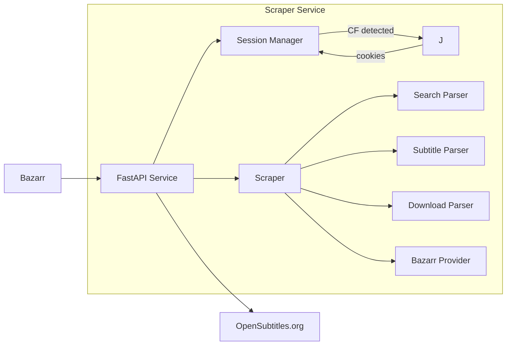

# OpenSubtitles.org Scraper

[](https://www.python.org/downloads/)
[](https://fastapi.tiangolo.com/)
[](LICENSE)

A self-hosted service that scrapes OpenSubtitles.org and exposes Bazarr-compatible API endpoints. Drop-in replacement for the removed .org provider.


## Why this exists

OpenSubtitles.org has been the go-to subtitle database for almost 20 years. Millions of subtitles, contributed by volunteers, freely accessible. That's changing.

The operator is phasing out .org in favour of .com. The problem is that **.com is not ready**. Their own developers have acknowledged missing subtitles, miscategorised episodes, broken sync, and unreliable search. For many languages and older titles, .org is still the only source with real coverage.

Meanwhile, every official way to access .org has been killed. Bazarr dropped its .org provider. The XML-RPC API was shut down. No migration path, no transition tooling. Users who depend on .org content that doesn't exist on .com yet were simply cut off.

This project fills that gap. It gives you back access to .org until .com actually catches up. It ships with strict rate limits out of the box (1 req/s, 60 req/min) because the goal is access, not abuse.

If .org gets shut down before .com reaches parity, that's the operator's call — but it means cutting a community off from the archive it built, not protecting it.

> Rate limits are enforced by default and fully configurable. See [Configuration](#configuration).


## Features

- Cloudflare handling via [cloudscraper](https://github.com/VeNoMouS/cloudscraper) + [FlareSolverr](https://github.com/FlareSolverr/FlareSolverr) fallback
- Automatic FlareSolverr integration when Cloudflare "Under Attack" mode is active
- Cookie caching — FlareSolverr is only called once per challenge cycle, subsequent requests go direct
- Full language support with ISO 639-1/639-2 mapping
- FastAPI service with auto-generated docs at `/docs`
- Bazarr-compatible search and download endpoints
- HTML parsing for search results, subtitle listings, and downloads
- Built-in rate limiting, retry with backoff, and request queuing
- Thread-safe with double-solve prevention and rate limiter locking
- Docker-ready with FlareSolverr sidecar


## Architecture


```mermaid
graph LR
    A[Bazarr] --> B[FastAPI Service]
    B --> C[OpenSubtitles.org]
    subgraph "Scraper Service"
        B --> D[Session Manager]
        B --> E[Scraper]
        D -->|"CF detected"| J
        J -->|"cookies"| D
        E --> F[Search Parser]
        E --> G[Subtitle Parser]
        E --> H[Download Parser]
        E --> I[Bazarr Provider]
    end
```

### Cloudflare Challenge Flow

1. Pre-flight HEAD request detects Cloudflare challenge
2. If active: FlareSolverr solves the challenge via headless browser
3. Cookies + User-Agent are extracted and injected into the session
4. All subsequent requests use the cookies directly (no browser needed)
5. When cookies expire (TTL tracked), FlareSolverr is called again automatically

FlareSolverr is optional — if not configured, the scraper falls back to cloudscraper only.


## Quick Start

### Docker (recommended)

```bash
# Optional: customise settings
cp .env.example .env

# Build and run (includes FlareSolverr sidecar for Cloudflare handling)
docker-compose up
```

Service starts on `http://localhost:8000`. FlareSolverr starts automatically as a sidecar — the scraper waits for it to be healthy before accepting requests.

To run without FlareSolverr, unset `FLARESOLVERR_URL` or remove the service from `docker-compose.yml`.

### Manual

```bash
pip install -r requirements.txt
cp .env.example .env   # optional
python main.py
```


## API

| Method | Endpoint | Description |
|--------|----------|-------------|
| `GET` | `/api/v1/health` | Health check |
| `POST` | `/api/v1/search/movies` | Search movies |
| `POST` | `/api/v1/search/tv` | Search TV shows |
| `POST` | `/api/v1/subtitles` | List subtitles for a title |
| `POST` | `/api/v1/download` | Download a subtitle file |
| `GET` | `/docs` | Swagger UI |

Bazarr-compatible endpoints are also available at `/search` and `/download` (without the `/api/v1` prefix).

### Examples

```bash
# Search
curl -X POST http://localhost:8000/api/v1/search/movies \
     -H "Content-Type: application/json" \
     -d '{"query": "Avatar", "year": 2009}'

# Get subtitles
curl -X POST http://localhost:8000/api/v1/subtitles \
     -H "Content-Type: application/json" \
     -d '{"movie_url": "https://www.opensubtitles.org/en/movies/idmovies-123456", "languages": ["en", "es"]}'

# Download
curl -X POST http://localhost:8000/api/v1/download \
     -H "Content-Type: application/json" \
     -d '{"subtitle_id": "123456", "download_url": "https://www.opensubtitles.org/download/..."}'
```


## Bazarr Integration

Three ways to use it:

1. **API mode** — point Bazarr at this service's endpoints
2. **Provider classes** — use `src/providers/` directly in your Bazarr fork
3. **Drop-in replacement** — swap the OpenSubtitles provider

```python
from src.providers.opensubtitles_scraper_provider import OpenSubtitlesScraperProvider
from src.providers.base_provider import Language, Movie

provider = OpenSubtitlesScraperProvider()
provider.initialize()

video = Movie("Avatar.2009.1080p.BluRay.x264-GROUP", "Avatar", 2009)
subtitles = provider.list_subtitles(video, {Language('en'), Language('es')})

if subtitles:
    provider.download_subtitle(subtitles[0])
    print(subtitles[0].content.decode('utf-8'))

provider.terminate()
```


## Configuration

All settings are configurable via environment variables or a `.env` file. Docker Compose loads `.env` automatically.

Copy the example and adjust:
```bash
cp .env.example .env
```

### Rate Limits

The service enforces rate limits in two places:

```
Bazarr ──► [ Inbound gate ] ──► Scraper ──► [ Outbound gate ] ──► OpenSubtitles.org
```

**Inbound (Bazarr → Scraper API)** — protects the scraper from being overwhelmed by concurrent callers. When the limit is hit, the API responds `429 Too Many Requests` with a `Retry-After` header.

| Variable | Default | What it does |
|---|---|---|
| `SCRAPER_MAX_INFLIGHT_REQUESTS` | `2` | Max concurrent API requests being processed. Extra requests are queued or rejected. |
| `SCRAPER_QUEUE_TIMEOUT` | `0` | Seconds to wait in queue before returning 429. `0` = reject immediately (no queue). |
| `SCRAPER_RETRY_AFTER_SECONDS` | `15` | Value of the `Retry-After` header sent with 429 responses. |

**Outbound (Scraper → OpenSubtitles.org)** — prevents hammering .org. These are the core rate limits.

| Variable | Default | What it does |
|---|---|---|
| `SCRAPER_MIN_REQUEST_INTERVAL` | `1.0` | Min seconds between any two requests to .org (per-second throttle). |
| `SCRAPER_RATE_LIMIT_PER_MINUTE` | `60` | Max requests to .org in any 60-second sliding window. |
| `SCRAPER_MAX_CONCURRENT_REQUESTS` | `2` | Max simultaneous outbound connections to .org. |

Defaults enforce **1 req/s and 60 req/min to .org**, with at most **2 concurrent API requests** accepted from Bazarr.

### Other Settings

| Variable | Default | What it does |
|---|---|---|
| `SCRAPER_MAX_RETRIES` | `2` | Retries on 429/5xx from .org |
| `SCRAPER_RETRY_BACKOFF_FACTOR` | `2` | Backoff multiplier between retries |
| `SCRAPER_REQUEST_TIMEOUT` | `30` | HTTP timeout per request in seconds |
| `SCRAPER_MAX_POOL_CONNECTIONS` | `5` | Connection pools to cache |
| `SCRAPER_MAX_POOL_SIZE` | `3` | Connections per pool |
| `SCRAPER_MAX_REQUESTS_BEFORE_CLEANUP` | `20` | Requests between pool cleanup |
| `FLARESOLVERR_URL` | _(unset)_ | FlareSolverr endpoint (e.g. `http://flaresolverr:8191/v1`). Leave unset to disable. |
| `FLARESOLVERR_TIMEOUT` | `60` | Timeout in seconds for FlareSolverr challenge resolution |

> **FlareSolverr note:** When running via `docker-compose.yml`, `FLARESOLVERR_URL` is pre-configured to use the sidecar service. To disable FlareSolverr, comment out both the `flaresolverr` service and the `FLARESOLVERR_URL` environment line in the compose file.


## Project Structure

```
opensubtitles-scraper/
├── src/
│   ├── api/              # FastAPI routes and models
│   ├── core/             # Scraper engine and session management
│   ├── parsers/          # HTML parsing (search, subtitles, downloads)
│   ├── providers/        # Bazarr-compatible provider interface
│   └── utils/            # Exceptions and helpers
├── vendor/               # Vendored cloudscraper
├── main.py
├── requirements.txt
├── .env.example
├── Dockerfile
└── docker-compose.yml
```


## Troubleshooting

**Cloudflare blocks** — cloudscraper handles most challenges automatically. If it persists, the session recreates itself.

**Parsing breaks** — .org layout changes can break parsers. Open an issue or PR.

**Connection errors** — check your network. The service has built-in retry with exponential backoff.

**Debug logging:**
```bash
LOG_LEVEL=DEBUG python main.py
```


## Contributing

1. Follow existing code patterns
2. Keep files under 500 lines
3. Include error handling and logging
4. Test against live .org data

### Contributors

- **[@salwinh](https://github.com/salwinh)** — language-specific URL filtering, TV series detection, subtitle metadata extraction

---

## About

Maintained by **[LavX](https://lavx.hu)**.

Other projects:
- [AI Subtitle Translator](https://github.com/LavX/ai-subtitle-translator) — LLM-powered subtitle translation via OpenRouter
- [Bazarr (LavX Fork)](https://github.com/LavX/bazarr) — automated subtitle management with .org scraper and AI translation
- [LMS Tools](https://tools.lavx.hu) — 140+ free, privacy-focused dev tools

---

## License

MIT. See [LICENSE](LICENSE).

Use responsibly. Keep the default rate limits enabled.
